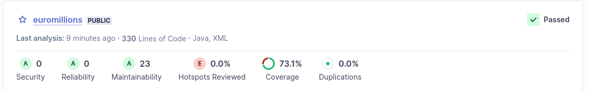
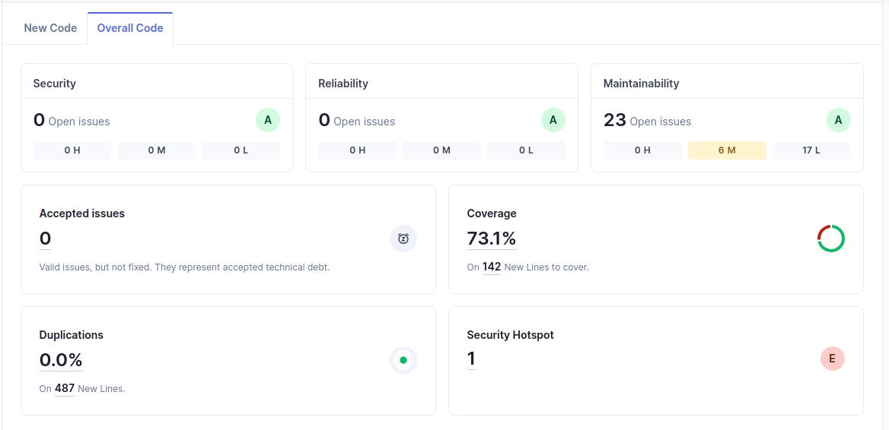
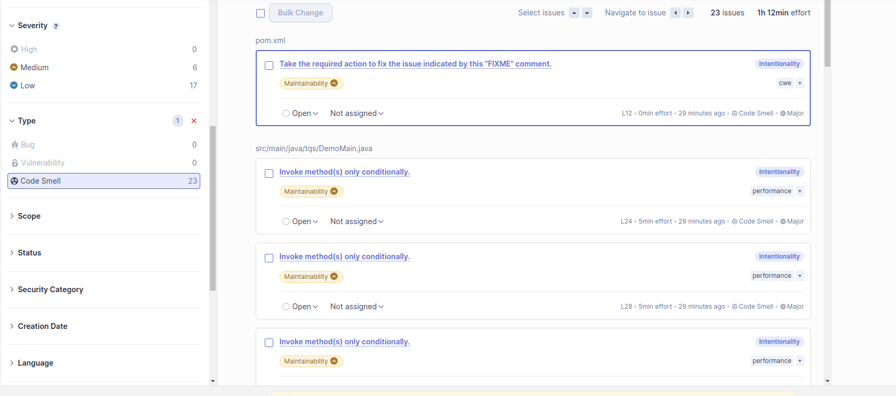
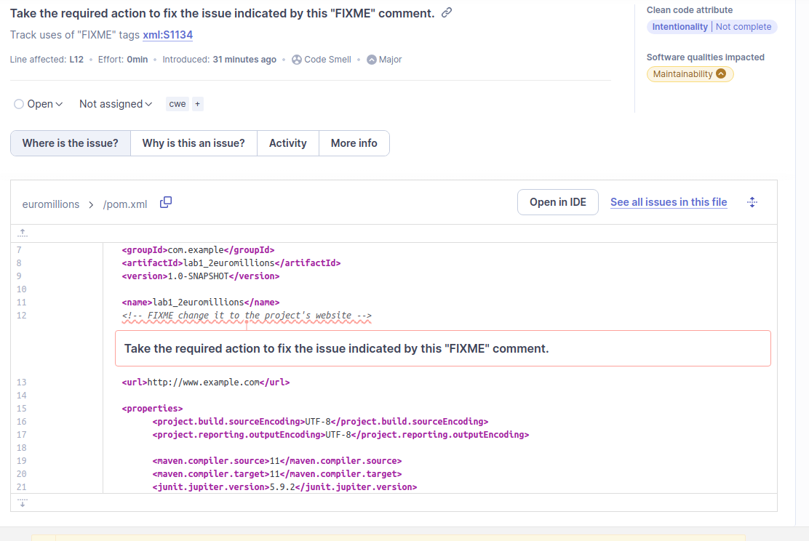

# e) Confirm that Sonar analysis was executed. Access the SonarQube dashboard (default :http://127.0.0.1:9000). Has your project passed the defined quality gate? Elaborate your answer.

Checking the SonarQube dashboard I was able to verufy that my code passed the quality gate with the stated metrics:
- Security Rating: A (0)
- Reliability Rating: A (0)
- Maintainability Rating: A (23 open issues)
- Coverage: 73.1%
- Duplications: 0.0%
- Security Hotspots: 0.0% -> 1

# f) Explore the analysis results and complete with a few sample issues, as applicable.

| Issue | Problem Description | How to solve | 
| --- | --- | --- |
| Code Smells | "Take the required action to fix the issue indicated by this "FIXME" comment" | check image below |

