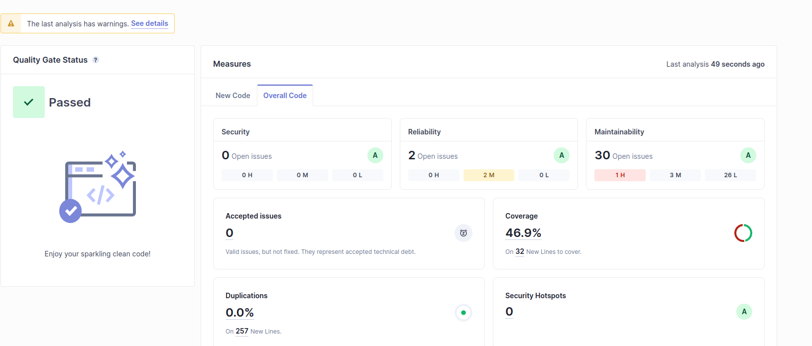
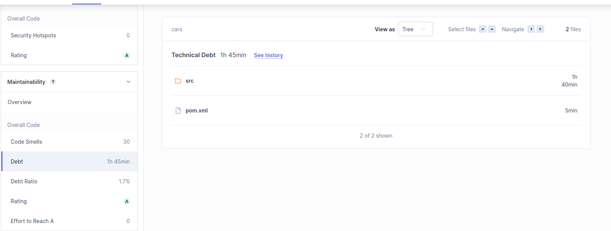
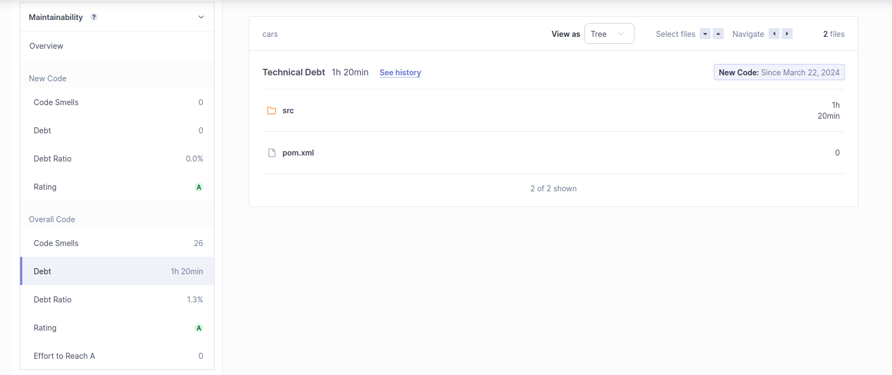
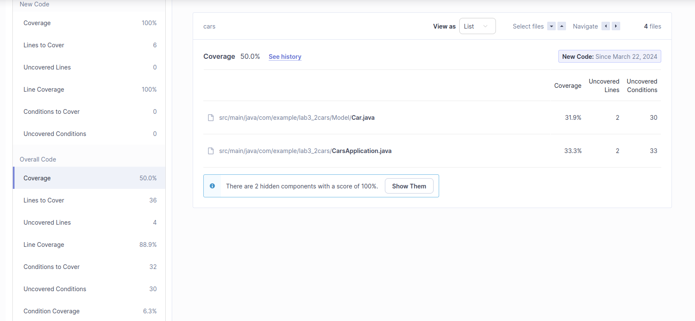

# a)
**Technical Debt:** describes what results when development teams take actions to expedite the delivery of a piece of functionality or a project which later needs to be refactored. In other words, it's the result of prioritizing speedy delivery over perfect code.

DashBoard Screenshots:

# b) 

After resolving all the Critical and Major code smells, the Technical Debt is reduced to 1h20min. The code smells were resolved by refactoring the code, by removing the @Autowired annotation.

# c)

The coverage is 50%, the "Lines to Cover" are 36 and the "Uncovered Lines" are 4. The cline coverage is 88,9%.
Juging by the coverage, the code is not well tested, since it only covers 50% of the code.

